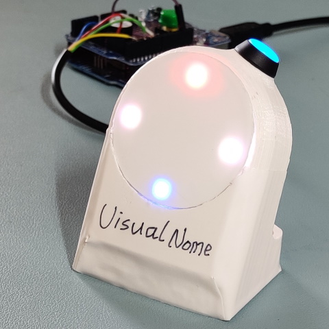

# Visual-nome

# Features
- Single button interface, short press to start / stop.
- (to be added) 'tap to set BPM' by long press when stopped.
- An indicator runs around the ring every measure / bar (4 beats).
- Whole ring flashes on every beat. Downbeat or upbeat configurable.
- First beat accented (stronger flash, higher buzz tone)
- Stationary marks on every beat.

# Bill of material
- A microcontroller, such as an Arduino
- Neopixel LED ring. 16-pixel is perfect for rock beat. 1/16th note for each pixel. 12-pixel will be good for blues (4 triplets)
- A pushbutton switch (normally open)
- A piezo buzzer

# How to use
- The easist way is to use VS Code with PlatformIO extension. The platformio.ini will take charge of the project.
- Make sure libraries (Adafruit_NeoPixel and JC_Button) are available.
- src/main.cpp is the main program to compile and load to the microcontroller
- Change the variables in src/Defines.h as you wish